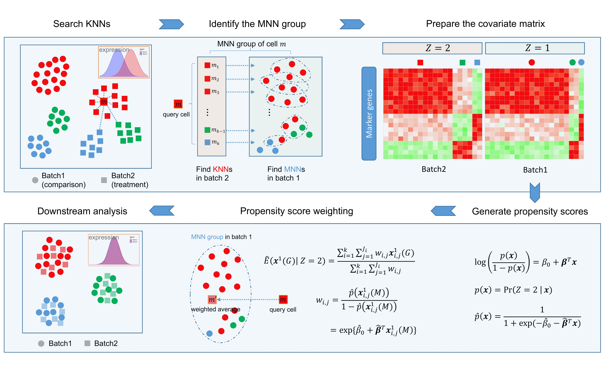

#  Multi-batch integration with scPSM

## 1 Overview

This repository contains the code for the paper **Propensity Score Matching enables batch effect corrected imputation in single-cell RNA-seq analysis** by Xu _et al._

ScPSM (a **p**ropensity **s**core **m**atching method for **sc**RNA-seq data) is a statistical tool useful for simultaneously correcting batch effect, imputing dropout and denoising gene expression.

## 2 Installation

```r
devtools::install_github("eleozzr/scPSM")
```

The installation should only take a few seconds.
The dependencies of the package are listed in the DESCRIPTION file of the package.

## 3 Usage

We provide two ways to run our methods. For the fist one, the authors can install `scPSM` package and then use the internal function `psm_integrate`. For the second one, the authors can run external R script. 

### 3.1 using `scPSM` package

Start with the vignette [online](./vignettes/README.md) in `./vignettes/README.md`.

### 3.2 using the main function directly 

To perform scPSM, first run the help function in  file [`utils.R`](./R/scPSM_utils.R), then run the script [`scPSM_main.R`](./R/scPSM_main.R). Then the function `psm_integrate` will be loaded, we can refer to [tutorial_pancreas.md](./external_tutorial/scPSM_pancreas.md) for detail running steps. 

```
psm_integrate <- function(batches, markers, hvg, k.self=10, k.mnn=10,
                          correct.all=TRUE, merge.order=1:4){
                          ...
                          }
```


#### Arguments

- **`batches`** A list of one or more log-normalized-expression matrices where genes correspond to rows and cells correspond to columns. Each matrix should contain the same number of rows, corresponding to the same genes in the same order. Each matrix represents a batch.
- **`markers`** A vector specifying which features used as marker genes to compute propensity scores.
- **`hvg`** A vector specifying which features used as HVGs for identifying MNN group.
- **`k.self`** An integer scalar specifying the number of nearest neighbors in searching KNNs.
- **`k.mnn`** An integer scalar specifying the number of nearest neighbors in matching MNN pairs.
- **`correct.all`** A logical scalar specifying whether correction should be applied to all genes, even if only a subset is used for the MNN group identification.
- **`merge.order`** An integer vector containing the linear merge order of batches.

#### Value

- Returns a dgCMatrix of integrated data with rows corresponding to the same genes and columns corresponding to the same cells as in the argument **`batches`**.

**Note:** To run the example require the software *R >= 4.0.0*, *batchelor >= 1.4.0*, *BiocNeighbors >= 1.6.0* and *BiocParallel >= 1.22.0*.


## 4 Simulation Data

The code of generating simulation datasets for Fig 2 and Fig S4 is available in [simulation_data.md](./external_tutorial/simulation_data.md).


## 5 Real Data

The original data for the toy example is available in the **`inst/extdata`** folder  

- **pancreas_expression_matrix.rds**, Load [`pancreas_expression_matrix.rds`](./inst/extdata/pancreas_expression_matrix.rds) from `./inst/extdata/pancreas_expression_matrix.rds` for a dgCMatrix with rows corresponding to 34363 genes and columns corresponding to 6321 cells.  
- **pancreas_metadata.rds**, Load [`pancreas_metadata.rds`](./inst/extdata/pancreas_metadata.rds) from `./inst/extdata/pancreas_metadata.rds` to get the batch (the "tech" item) and celltype information for all cells .  
- **HVGs_1000.txt**, [`HVGs_1000.txt`](./inst/extdata/HVGs_1000.txt) can be extracted from *adata.var.index[adata.var["highly_variable"] == True].values* by implementing the python function *sc.pp.highly_variable_genes(adata, n_top_genes=1000, batch_key='tech')* by *impoting `scanpy` as sc*, or from *obj[["RNA"]]@var.features* by implementing the R function *FindVariableFeatures(obj, nfeatures = 1000)* by *library(`Seurat`)*.  

## 6 Cheatsheet

You can also refer to this cheatsheet to undersand a common workflow

