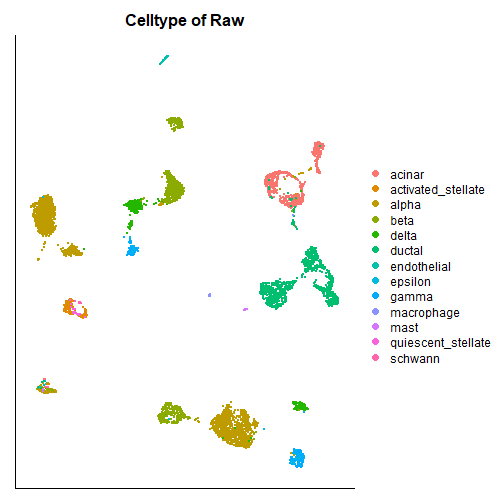
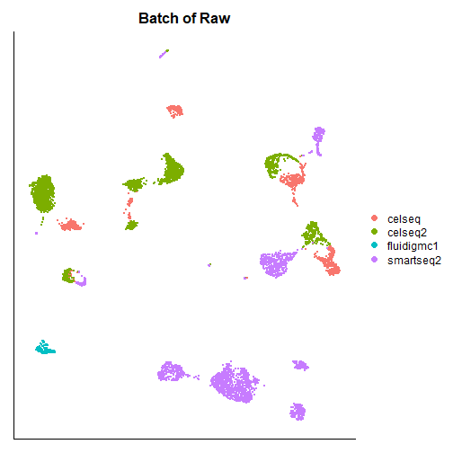
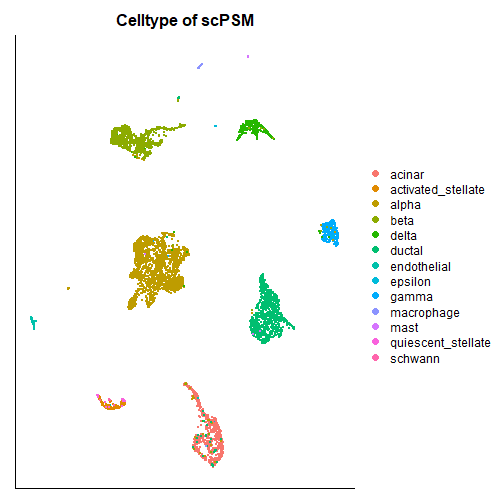
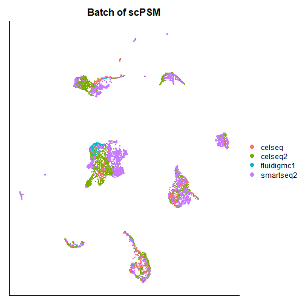

# 1. Data preprocessing

Remove any cells expressing less than 200 genes, and any genes expressed in less than 30 cells, and any cells expressing mitochondrial genes more than 5% of total genes.


```r
#load necessary package
library(Seurat)
library(ggplot2)

#read data
pancreas.data <- readRDS(file = "../inst/extdata/pancreas_expression_matrix.rds")
# 34363 * 6321
metadata <- readRDS(file = "../inst/extdata/pancreas_metadata.rds")
pancreas <- CreateSeuratObject(counts = pancreas.data, meta.data = metadata, min.cells = 30, min.features = 200)
# 21215 * 6321
pancreas$percent.mito <- PercentageFeatureSet(object = pancreas, pattern = "^MT-")
pancreas <- subset(pancreas, subset = percent.mito < 5)
# 21215 * 5842
```

# 2. UMAP visualization for raw data


```r
pancreas <- NormalizeData(pancreas)
# find 2000 HVGs for UMAP visualization
pancreas <- FindVariableFeatures(pancreas, nfeatures = 2000)
```


```r
# PCA dimension reduction
raw <- pancreas
raw <- ScaleData(raw, verbose = T)
raw <- RunPCA(raw, verbose = T)
# run UMAP
raw <- RunUMAP(raw, reduction = "pca", dims = 1:30, check_duplicates = FALSE)
```


```r
# visualization
DimPlot(raw, reduction = "umap", group.by = "celltype")+
    theme(axis.ticks=element_blank(),
          axis.text.y=element_blank(),
          axis.text.x=element_blank())+
    xlab(NULL)+ylab(NULL)+
    labs(title = "Celltype of Raw")
```



```r
DimPlot(raw, reduction = "umap", group.by = "tech")+
    theme(axis.ticks=element_blank(),
          axis.text.y=element_blank(),
          axis.text.x=element_blank())+
    xlab(NULL)+ylab(NULL)+
    labs(title = "Batch of Raw")
```




# 3. scPSM integration


```r
# 21 marker genes to compute propensity scores
markers <- c("REG1A", "SST", "GHRL", "VWF",
             "INS", "GCG", "NKX6-1", "PDX1", "IAPP",
             "PCSK2", "AMY2A",
             "MAFA", "MAFB", "IRX1", "IRX2", "ARX",
             "KRT19", "CPA1", "PDGFRB", "HHEX", "ESR1")
# read highly variable genes 
hvg <- scan("../inst/extdata/HVGs_1000.txt", what = "c")
# Subsetting by 'batch'.
pancreas.list <- SplitObject(object = pancreas, split.by = "tech")
# celseq 1004, celseq2 2285, fluidigmc1 638, smartseq2 2394
```

Prepare data for scPSM.


```r
# perform log-normalization individually for each batch
celseq2 <- NormalizeData(object = pancreas.list[["celseq2"]])
smartseq2 <- NormalizeData(object = pancreas.list[["smartseq2"]])
celseq <- NormalizeData(object = pancreas.list[["celseq"]])
fluidigmc1 <- NormalizeData(object = pancreas.list[["fluidigmc1"]])

B1 <- smartseq2[["RNA"]]@data
B2 <- celseq2[["RNA"]]@data
B3 <- celseq[["RNA"]]@data 
B4 <- fluidigmc1[["RNA"]]@data
batches <- list(B1, B2, B3, B4)
```

Run scPSM.


```r
# load internal functions 
source('../R/utils.R')
# load the main function
source('../R/scPSM_main.R')

psm.data <- psm_integrate(batches = batches, markers = markers, hvg = hvg, merge.order = 1:4)
```


```r
# saveRDS(psm.data, file = "./psm_result.rds")
```


# 4. UMAP visualization for scPSM


```r
psm.data <- readRDS(file = "./psm_result.rds")
psm <- pancreas
psm[["RNA"]]@data <- t(psm.data)
psm <- ScaleData(psm, verbose = T)
psm <- RunPCA(psm, verbose = T)
psm <- RunUMAP(psm, reduction = "pca", dims = 1:30, check_duplicates = FALSE)
```


```r
# visualization
DimPlot(psm, reduction = "umap", group.by = "celltype")+
    theme(axis.ticks=element_blank(),
          axis.text.y=element_blank(),
          axis.text.x=element_blank())+
    xlab(NULL)+ylab(NULL)+
    labs(title = "Celltype of scPSM")
```



```r
DimPlot(psm, reduction = "umap", group.by = "tech")+
    theme(axis.ticks=element_blank(),
          axis.text.y=element_blank(),
          axis.text.x=element_blank())+
    xlab(NULL)+ylab(NULL)+
    labs(title = "Batch of scPSM")
```



