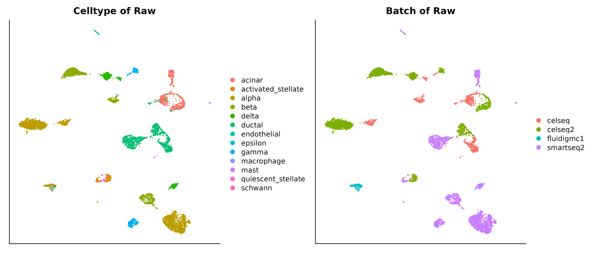
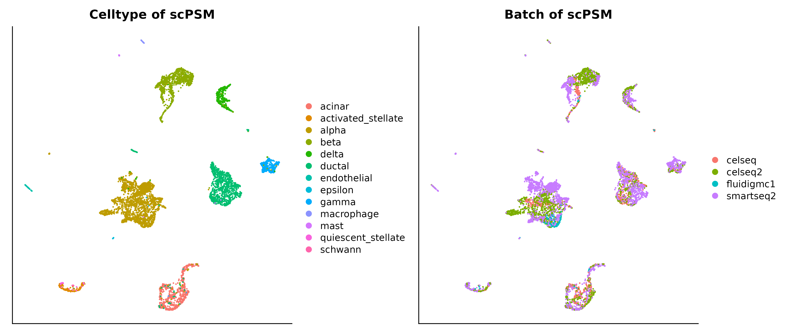

``` r
suppressPackageStartupMessages(library(Seurat))
suppressPackageStartupMessages(library(scPSM))
suppressPackageStartupMessages(library(Matrix))
suppressPackageStartupMessages(library(ggplot2))
```

# Data preprocessing

Remove any cells expressing less than 200 genes, and any genes expressed
in less than 30 cells, and any cells expressing mitochondrial genes more
than 5% of total genes.

``` r
pancreas.data <- readRDS(system.file("extdata","pancreas_expression_matrix.rds",package="scPSM"))

# 34363 * 6321
metadata <- readRDS(system.file("extdata","pancreas_metadata.rds",package="scPSM"))
pancreas <- CreateSeuratObject(counts = pancreas.data, meta.data = metadata, min.cells = 30, min.features = 200)
# 21215 * 6321
pancreas$percent.mito <- PercentageFeatureSet(object = pancreas, pattern = "^MT-")
pancreas <- subset(pancreas, subset = percent.mito < 5)
# 21215 * 5842
```

``` r
pancreas <- NormalizeData(pancreas)
# find 2000 HVGs for UMAP visualization
pancreas <- FindVariableFeatures(pancreas, nfeatures = 2000)
```

# UMAP visualization for raw data

``` r
# PCA dimension reduction
raw <- pancreas
raw <- ScaleData(raw, verbose = T)
#> Centering and scaling data matrix
raw <- RunPCA(raw, verbose = T)
#> PC_ 1 
#> Positive:  MT-CO2, MT-ND4, MT-CO1, MT-ND2, MT-CO3, MT-ND5, MT-CYB, AC087473.1, MT-ATP6, MT-ND1 
#>     MT-ND4L, LINC00504, ATP5F1E, MT-ND6, RACK1, ATP5MC2, ATP5MG, CD99, NORAD, ATP5F1B 
#>     ATP5PF, ATP5F1A, RPL21, PRXL2C, BEX3, AC124312.1, PRELID3B, CNOT9, FLJ22447, SELENOK 
#> Negative:  HSPB1, TACSTD2, CLDN4, SERPINA3, CFB, SDC4, KRT18, KRT8, KRT7, GATM 
#>     LCN2, SERINC2, REG1A, ANXA4, PDZK1IP1, GDF15, CLDN1, MUC1, AKR1C3, GPX2 
#>     ZFP36L1, LGALS3, CTSH, JUN, OLFM4, PRSS8, ANPEP, CDC42EP1, MUC20, KRT19 
#> PC_ 2 
#> Positive:  COL4A2, SERPINH1, COL4A1, SPARC, FSTL1, PXDN, LGALS1, NID1, CALD1, NOTCH3 
#>     COL15A1, PDGFRB, IGFBP4, COL1A2, ITGA5, CLIC4, PTRF, BGN, FN1, COL3A1 
#>     MSN, COL18A1, COL6A2, COL1A1, MRC2, ZFP36L1, LTBP1, MFGE8, GNG11, FLNA 
#> Negative:  VGF, CRYBA2, RASD1, FAM167A, LOXL4, C10orf10, CFC1, PCSK1, PLCE1, FAM159B 
#>     EFNA5, PAPPA2, DHRS2, KLHL41, PDK4, EDN3, CRH, INS, CACNB2, RBP4 
#>     NPTX2, DPP4, IAPP, ENPP1, PFKFB2, TOX3, ADCYAP1, ARRDC4, DPYSL2, NT5DC3 
#> PC_ 3 
#> Positive:  TACSTD2, SERPINA3, CFB, SDC4, KRT8, LCN2, ANXA4, TM4SF1, KRT7, KRT18 
#>     PDZK1IP1, IL32, GATM, SAT1, AKR1C3, MUC1, CLDN4, CD44, CLDN1, C3 
#>     ANPEP, SOD2, TMC5, CLDN10, PRSS8, SERINC2, REG1A, GSTA1, MUC20, CTSH 
#> Negative:  SPARC, COL1A2, PDGFRB, COL3A1, COL6A2, COL5A1, COL15A1, BGN, COL5A2, MRC2 
#>     NID1, CDH11, SFRP2, LUM, CYGB, TIMP1, THBS2, COL1A1, AEBP1, FBN1 
#>     IGFBP5, LOXL2, IGFBP4, ITGA1, LAMA4, TIMP3, DKK3, SPON2, DCN, HTRA3 
#> PC_ 4 
#> Positive:  CFTR, KRT19, SPP1, TINAGL1, AQP1, VTCN1, MMP7, PPAP2C, ALDH1A3, KRT23 
#>     TSPAN8, SERPING1, SLC3A1, HSD17B2, ANXA3, SERPINA5, LGALS4, CEACAM7, SDC1, DEFB1 
#>     CTSH, SERPINA1, ANXA9, CCND1, CA2, TFPI2, SERPINA6, CLDN10, VCAM1, APCDD1 
#> Negative:  CPA2, CTRB2, PNLIP, CPA1, PLA2G1B, CTRB1, CTRC, PRSS3P2, REG1B, CPB1 
#>     PRSS1, CELA2A, CEL, CELA3A, KLK1, BCAT1, PRSS3, PNLIPRP2, GSTA2, PNLIPRP1 
#>     ALB, SPINK1, CELA3B, REG3A, REG1A, GP2, MGST1, ALDOB, CTRL, CLPS 
#> PC_ 5 
#> Positive:  FLT1, PECAM1, KDR, ESAM, PODXL, PLVAP, ELTD1, CD93, ECSCR, ERG 
#>     RGCC, MYCT1, ACVRL1, MMRN2, GPR4, PTPRB, S1PR1, CALCRL, EMCN, CLEC14A 
#>     CDH5, NOTCH4, ROBO4, PASK, ABI3, TIE1, ESM1, GIMAP4, F2RL3, GPR116 
#> Negative:  SFRP2, LUM, COL3A1, THBS2, PDGFRB, NOTCH3, COL5A1, COL1A2, COL6A3, CDH11 
#>     DCN, COL1A1, LTBP2, FMOD, COL5A2, COL6A1, TNFAIP6, LAMC3, SPON2, FN1 
#>     CYGB, PRRX1, C1S, BGN, VCAN, MXRA8, COL6A2, TPM2, ANTXR1, WISP1
# run UMAP
raw <- RunUMAP(raw, reduction = "pca", dims = 1:30, check_duplicates = FALSE)
#> Warning: The following arguments are not used: check_duplicates
#> 16:37:54 UMAP embedding parameters a = 0.9922 b = 1.112
#> 16:37:54 Read 5842 rows and found 30 numeric columns
#> 16:37:54 Using Annoy for neighbor search, n_neighbors = 30
#> 16:37:54 Building Annoy index with metric = cosine, n_trees = 50
#> 0%   10   20   30   40   50   60   70   80   90   100%
#> [----|----|----|----|----|----|----|----|----|----|
#> **************************************************|
#> 16:37:55 Writing NN index file to temp file /tmp/RtmpczqrHM/file4508379509673
#> 16:37:55 Searching Annoy index using 1 thread, search_k = 3000
#> 16:37:56 Annoy recall = 100%
#> 16:37:57 Commencing smooth kNN distance calibration using 1 thread
#> 16:37:58 Initializing from normalized Laplacian + noise
#> 16:37:59 Commencing optimization for 500 epochs, with 244712 positive edges
#> 16:38:05 Optimization finished
```

``` r
# visualization
p1=DimPlot(raw, reduction = "umap", group.by = "celltype")+
    theme(axis.ticks=element_blank(),
          axis.text.y=element_blank(),
          axis.text.x=element_blank())+
    xlab(NULL)+ylab(NULL)+
    labs(title = "Celltype of Raw")
p2=DimPlot(raw, reduction = "umap", group.by = "tech")+
    theme(axis.ticks=element_blank(),
          axis.text.y=element_blank(),
          axis.text.x=element_blank())+
    xlab(NULL)+ylab(NULL)+
    labs(title = "Batch of Raw")
```

``` r
patchwork::wrap_plots(list(p1,p2),ncol=2)
```



# scPSM integration

``` r
# 21 marker genes to compute propensity scores
markers <- c("REG1A", "SST", "GHRL", "VWF",
             "INS", "GCG", "NKX6-1", "PDX1", "IAPP",
             "PCSK2", "AMY2A",
             "MAFA", "MAFB", "IRX1", "IRX2", "ARX",
             "KRT19", "CPA1", "PDGFRB", "HHEX", "ESR1")
# read highly variable genes 
hvg <- scan(system.file("extdata","HVGs_1000.txt",package = "scPSM"), what = "c")
# Subsetting by 'batch'.
pancreas.list <- SplitObject(object = pancreas, split.by = "tech")
# celseq 1004, celseq2 2285, fluidigmc1 638, smartseq2 2394
```

-   Prepare data for scPSM.

``` r
# perform log-normalization individually for each batch
celseq2 <- NormalizeData(object = pancreas.list[["celseq2"]])
smartseq2 <- NormalizeData(object = pancreas.list[["smartseq2"]])
celseq <- NormalizeData(object = pancreas.list[["celseq"]])
fluidigmc1 <- NormalizeData(object = pancreas.list[["fluidigmc1"]])

B1 <- smartseq2[["RNA"]]@data
B2 <- celseq2[["RNA"]]@data
B3 <- celseq[["RNA"]]@data 
B4 <- fluidigmc1[["RNA"]]@data
batches <- list(B1, B2, B3, B4)
```

## <span style="color:red; font-size:1.2em">Run scPSM </span>

``` r
psm.data <- scPSM::psm_integrate(batches = batches, markers = markers, hvg = hvg, merge.order = 1:4)
```

# UMAP visualization for scPSM

``` r
#saveRDS(psm.data, file = "./psm_result.rds")
#psm.data <- readRDS(file = "./psm_result.rds")
psm <- pancreas
psm[["RNA"]]@data <- t(psm.data)
psm <- ScaleData(psm, verbose = T)
#> Centering and scaling data matrix
psm <- RunPCA(psm, verbose = T)
#> Warning in PrepDR(object = object, features = features, verbose = verbose): The following 563 features requested have zero variance (running reduction without them):
#> DEPP1, ARFGEF3, RACK1, TENT5A, ANKRD36C, SLC25A6, ADA2, ERO1B, TENT5C, MT-ATP6, MT-ND1, MT-ND2, ERO1A, ERBIN, ATP5F1B, AL354740.1, SHLD2, AC145207.5, MT-CYB, NORAD,
#> PCNX4, CUZD1, SUSD6, SARAF, INTS14, MT-CO1, MT-ND5, ATP5F1A, MT-CO2, RETREG3, MT-CO3, LNPK, GUCY1B1, MT-ND4, NSD2, AL035071.1, NRDC, RBSN, AP003469.4, DOP1A, AC118549.1,
#> ATP5PB, RTL10, GRAMD2B, UTP4, CYTOR, ADGRG1, RPL21, HACD3, AC087473.1, FAM234B, OGA, EIF4A1, CNOT9, AP001267.1, SELENOT, PRELID3B, ZUP1, MTREX, EEF1AKMT3, JPT2, BEX3,
#> PRUNE1, RETREG2, VPS26C, NAXD, SRPRA, ATP5F1C, VPS35L, SPATA13.1, CYREN, ARL17B, PUM3, WASHC4, GUCY1A1, KIF1BP, MINDY3, AC015813.1, PLPP3, ECPAS, JPT1, AC104794.2, SQOR,
#> TRMO, LARGE2, LINC01551, AC124312.1, DMAC2, NEPRO, AC010132.3, NSD3, KMT5B, MAP3K21, RTF2, ADGRG5, RGPD6, CLTRN, AC092279.1, MIR4453HG, FBH1, PIP4P1, ELOA, SINHCAF,
#> PNMA8A, KYAT3, WASHC2C, SPART, SNU13, VAMP7, MRE11, BMT2, NUP58, JHY, ELP1, TUT7, WDCP, RMC1, PLPPR5, TENT2, PLPP6, MRTFB, RETREG1, ODR4, PWAR6, ADGRL2, TIGAR, AL163636.2,
#> MRM3, SHLD3, KIRREL1, EFL1, DGLUCY, MTERF1, AC011978.2, CEP126, RUBCN, NECTIN2, AL512625.1, WHRN, STN1, CAVIN1, DELE1, PUDP, PLPPR4, MSC-AS1, WASHC5, MINDY1, RBM14-RBM4,
#> AC005261.3, PLPP5, RFLNB, AL365361.1, CEMIP2, ADGRV1, NBPF20, C4A, PCNX1, MTERF2, TOGARAM1, AC092683.1, PTGES3L-AARSD1, GLMP, MRM2, AC017071.1, NAXE, PLPPR2, PRXL2A,
#> GSDME, ANKRD20A2, MT-ND6, PGGHG, AFDN, SEPT5, NSMCE3, EEF2KMT, INAVA, TCIM, RTL6, AC005692.1, EIPR1, C4B, AF127577.4, AC012618.3, ARMH3, SPOUT1, CFAP70, BUD23, SELENOS,
#> HDGFL3, AC107982.3, TCAF1, ERG28, AL445686.2, VIRMA, COP1, CYBC1, MT-ND4L, OTULINL, CSKMT, SELENOF, MAGED4B, FAM234A, RTRAF, AC124944.3, MFSD14B, LINC02197, INTS13,
#> ATP5F1E, SULT1A3, WAPL, CENPS, CPLANE1, AC093010.3, TOMM70, ATP23, VPS50, NCBP3, LINC02532, AC010422.6, AHSA2P, AC090227.1, ABRAXAS2, SLF2, SGF29, EEF1AKMT2, MRTFA,
#> MAP3K20, BABAM2, AL590094.1, AC011815.1, FGF7P3, ATP5MG, AC007406.3, TENT4A, PATJ, NEMP2, AP006222.1, THAP12, TEPSIN, DNAAF5, KYAT1, UMAD1, TMEM267, DCAF1, UQCC3, VASH1-
#> AS1, UTP11, AC079447.1, AP000550.2, CCDC9B, NECTIN3, AL080250.1, BX088651.2, LINC01569, EIF3CL, LINS1, AC006213.2, ZRSR2P1, MTERF3, AC107068.1, AP003086.1, FAM241B,
#> MFSD14A, DUBR, CFAP43, MIR4435-2HG, NUP50-DT, FNDC10, FSBP, NEXMIF, MYDGF, RIOX2, PHETA1, AC008982.1, ATP5PO, DOP1B, B4GAT1, ADGRG2, LDAH, AC012370.2, ABRAXAS1, ADGRE5,
#> C11orf52, CCDC32, CTXND1, UTP25, RTL8B, SPDYE2, CFAP44, ATP5MC3, TEN1, RNFT1-DT, TMEM131L, C1QTNF5, LARGE1, AC005261.1, DNAJC3-DT, AC138393.1, KMT5A, PWRN3, RELCH,
#> SHISAL2B, CFAP20, AC008393.1, NSG2, PRXL2C, TMEM94, DHFR2, B3GLCT, ATP5MC2, P3H1, LINC01596, ERVK9-11, DUXAP10, SELENOK, PLPBP, MCRIP1, TCP11X2, AC106869.1, PPP4R3A,
#> SELENOO, NAA80, ARMH4, AP000462.1, AL136295.1, MARF1, CAVIN3, ARMT1, ITPRID2, DMRTC1B, AC012313.8, GATD3A, LINC02432, MIR99AHG, SELENOP, GATB, AC008770.2, BX088651.1,
#> HNRNPUL2-BSCL2, SAXO2, AL118556.1, MINDY2, ZFP91-CNTF, CENPX, RTL5, AL137802.2, HRAT92, GRAMD2A, SELENON, AL589843.1, LINC01725, BORCS7, FAM92A, AC016582.3, SHLD1,
#> Z68871.1, AC093323.1, SLF1, AC026150.1, MRPL58, CLBA1, LINC02082, AL163540.1, BBOF1, PLPP1, LINC02388, OSER1-DT, AC244197.2, BORCS5, LINC00205, FPGT-TNNI3K, AL590399.1,
#> USP41, AC110275.1, BICRAL, ASMTL, CBWD5, LINC00504, FYB2, AC139491.2, EEF1AKMT1, PMF1-BGLAP, AC090510.1, NECTIN1, RIC1, TIMM29, COQ8A, HACD2, AC084871.1, MISP3, NEMP1,
#> SCHIP1, LINC02315, FAM156B, RXYLT1, CFAP57, AP002990.1, REXO5, AC112229.1, AC090099.1, PKIA-AS1, ERVE-1, CARMIL2, FAM241A, AC099850.2, MTERF4, AC025283.2, AC008758.1,
#> FLVCR1-DT, PIP4P2, AC005332.2, ATP5IF1, SDHAF3, NECTIN4, AC073612.1, AC022893.2, AC105277.1, AC046185.1, LINC01376, AP001372.2, AL391361.2, CFAP97, USF3, CIAO2A, NKAPD1,
#> AL022068.1, GAREM1, AKAP17A, BORCS8, KAT14, AC138035.1, AL138752.2, TNS2, AL513329.1, TVP23C-CDRT4, AC083837.1, AC136944.2, BOLA2-SMG1P6, AL132780.3, RGPD5, AC007998.3,
#> AL022332.1, AC239799.1, RAB5IF, AP002884.3, AP001432.1, AC007342.5, AC093899.2, CCDC191, CIAO3, RN7SKP176, TUT4, AL592211.1, AL021546.1, ADGRA3, ALOX12-AS1, LINC01765,
#> AC066612.1, AC093227.1, AL356056.1, JMJD7-PLA2G4B, AC008915.2, MIGA2, TCEAL9, AL023284.4, DPH6-DT, AC015813.2, NAPRT, URB1-AS1, AC092118.1, TMEM35B, AC005838.2, MFSD4A,
#> AL139011.2, NPIPB12, SELENOI, AC026304.1, SNHG27, ESS2, CFAP36, INSYN2, ZNF561-AS1, AC007405.3, AC092368.3, SELENOW, AL359382.1, GTPBP6, AL358333.2, AL136295.2, GCN1,
#> AC005520.1, MAIP1, LINC02241, AC007161.1, AC106886.2, MFSD14C, PRXL2B, AC005041.1, KHDC4, STMP1, MRNIP, ITGB1-DT, AGAP9, AL669831.5, WASHC2A, BICDL1, ATP5PF, AC090527.2,
#> CARMIL1, CFAP410, AC087632.1, GPAT4, FAM111A-DT, AC123768.3, CFAP298, AL139412.1, AC022447.1, RIPOR1, LINC02352, MOSMO, AC104041.1, AC087463.4, AP003716.1, LINC01326,
#> AC092666.1, ATP6V1G2-DDX39B, AL592490.1, AC023632.2, PAXIP1-AS2, AC103736.1, GRK3, LINC01320, RTL8A, AC027698.1, RAMAC, EMSY, CCDC198, ILF3-DT, DEUP1, CIDEB, LINC02603,
#> AC040162.3, AC091563.1, AL157955.2, MUC20-OT1, AL162595.1, SELENOM, TMED7-TICAM2, AC012313.5, YAE1, AC012615.1, ADGRG4, PLPPR1, LINC01612, YJU2, AC132872.1, JCAD,
#> CABCOCO1, AC137767.1, LINC01715, AL133419.1, INKA2, NPIPB8
#> PC_ 1 
#> Positive:  EHD2, COL4A2, LGALS1, LGALS3, LTBP1, COL18A1, ENC1, ITGA5, SERPINH1, FLNA 
#>     C1S, MFGE8, PTRF, UACA, CDC42EP1, COL4A1, NOTCH3, C1R, ZFP36L1, DAB2 
#>     FSTL1, MYL9, GNG11, CALD1, FN1, PXDN, THBS1, SPHK1, SERPING1, LITAF 
#> Negative:  UBC, DPYSL2, CRYBA2, TIMP1, VGF, TPI1, CDC42BPA, RASD1, SRSF6, EFNA5 
#>     MORF4L1, FAM167A, CFC1, C10orf10, HMGN2, EDIL3, SLC39A9, RPS18, LOXL4, EEF1A1 
#>     FAM159B, DHRS2, PAPPA2, BRD7, PDK4, ZNF331, TXLNA, CACNB2, PLCE1, ANP32E 
#> PC_ 2 
#> Positive:  SPARC, COL1A2, COL3A1, BGN, PDGFRB, COL6A3, COL15A1, NID1, COL5A1, COL6A2 
#>     MRC2, MMP2, SFRP2, LRRC32, CDH11, LUM, HTRA3, DCN, TIMP3, THBS2 
#>     NID2, MXRA8, CYGB, GPNMB, LAMC3, COL5A2, LOXL2, ADAMTS4, THY1, PRRX1 
#> Negative:  SERPINA3, LCN2, CFB, SDC4, TACSTD2, PRSS8, KRT7, C3, PDZK1IP1, SERPINA4 
#>     IL32, AKR1C3, GATM, CLDN1, KRT18, MUC1, GPRC5B, ANPEP, PIGR, OLFM4 
#>     TMC5, UBD, CA12, TM4SF1, ADH1C, REG1A, CLDN10, ANXA4, DUOX2, KRT8 
#> PC_ 3 
#> Positive:  CTRC, CPA2, CTRB1, PNLIP, PLA2G1B, PNLIPRP2, CTRB2, REG1B, CELA2A, PRSS3P2 
#>     CELA3A, BCAT1, CPA1, PNLIPRP1, PDIA2, KLK1, PRSS1, CELA3B, RARRES2, REG3G 
#>     SYCN, REG3A, PRSS3, CPB1, ALB, CEL, GP2, DPEP1, GSTA2, CTRL 
#> Negative:  CFTR, TINAGL1, VTCN1, MMP7, AQP1, SPP1, KRT19, KRT23, PPAP2C, HSD17B2 
#>     ALDH1A3, TSPAN8, PMEPA1, TFPI2, SLC3A1, APCDD1, LGALS4, ANXA3, SDC1, CEACAM7 
#>     CXCL6, ANXA9, ANXA2, CA2, VCAM1, DAB2, TNFAIP2, CCND1, BICC1, NRP1 
#> PC_ 4 
#> Positive:  NOTCH3, COL1A1, COL6A3, MXRA8, COL3A1, SFRP2, LUM, DCN, COL1A2, PDGFRB 
#>     COL5A1, THBS2, MYL9, VCAN, PRRX1, CDH11, WISP1, GGT5, TNFAIP6, FN1 
#>     LAMC3, FMOD, PCOLCE, BGN, C1S, MMP11, COL5A2, CYGB, ADAMTS12, TGFB3 
#> Negative:  PLVAP, PODXL, RGCC, PECAM1, PCAT19, FLT1, KDR, S1PR1, ECSCR, ELTD1 
#>     ABI3, CLEC14A, ERG, ESAM, MYCT1, CD93, VWF, F2RL3, CDH5, ACVRL1 
#>     CALCRL, TIE1, MMRN2, ROBO4, EMCN, GPR4, GRAP, NKX2-3, ESM1, P2RY6 
#> PC_ 5 
#> Positive:  IAPP, NPTX2, INS, ADCYAP1, PCSK1, C1orf127, DLK1, BMP5, IGSF1, RBP4 
#>     RGS16, PFKFB2, RPH3A, MEG3, ALOX5, TSPAN1, GEM, FXYD2, HAPLN4, HHATL 
#>     FAM159B, MT1F, MT1X, GPX2, PIR, GRIA4, RGS2, ACSL1, MT2A, OXGR1 
#> Negative:  LOXL4, IGFBP2, MUC13, PAPPA2, CRYBA2, PLCE1, VGF, DPP4, PDK4, LDHA 
#>     TMEM45B, ARRDC4, HSPB1, PTP4A3, C15orf48, KLHL41, CRH, PDZK1, VWA1, CFC1 
#>     C10orf10, SERPINA1, CD36, INSR, SEPT6, TP53I11, ENPP1, RCN3, NNMT, CD44
psm <- RunUMAP(psm, reduction = "pca", dims = 1:30, check_duplicates = FALSE)
#> Warning: The following arguments are not used: check_duplicates
#> 16:45:04 UMAP embedding parameters a = 0.9922 b = 1.112
#> 16:45:04 Read 5842 rows and found 30 numeric columns
#> 16:45:04 Using Annoy for neighbor search, n_neighbors = 30
#> 16:45:04 Building Annoy index with metric = cosine, n_trees = 50
#> 0%   10   20   30   40   50   60   70   80   90   100%
#> [----|----|----|----|----|----|----|----|----|----|
#> **************************************************|
#> 16:45:05 Writing NN index file to temp file /tmp/RtmpczqrHM/file450837c318b20
#> 16:45:05 Searching Annoy index using 1 thread, search_k = 3000
#> 16:45:07 Annoy recall = 100%
#> 16:45:07 Commencing smooth kNN distance calibration using 1 thread
#> 16:45:07 18 smooth knn distance failures
#> 16:45:09 Initializing from normalized Laplacian + noise
#> 16:45:12 Commencing optimization for 500 epochs, with 244312 positive edges
#> 16:45:19 Optimization finished
```

``` r
# visualization
p1=DimPlot(psm, reduction = "umap", group.by = "celltype")+
    theme(axis.ticks=element_blank(),
          axis.text.y=element_blank(),
          axis.text.x=element_blank())+
    xlab(NULL)+ylab(NULL)+
    labs(title = "Celltype of scPSM")
p2=DimPlot(psm, reduction = "umap", group.by = "tech")+
    theme(axis.ticks=element_blank(),
          axis.text.y=element_blank(),
          axis.text.x=element_blank())+
    xlab(NULL)+ylab(NULL)+
    labs(title = "Batch of scPSM")
patchwork::wrap_plots(list(p1,p2),ncol=2)
```


